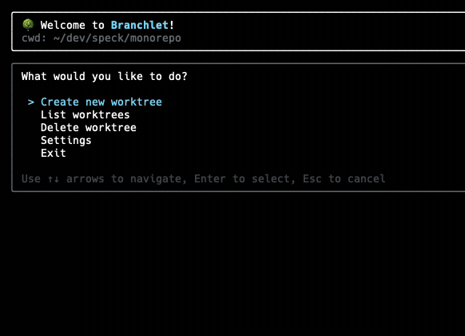

# 🌳 Branchlet

[](https://www.npmjs.com/package/branchlet)
[](https://www.npmjs.com/package/branchlet)

A interactive CLI tool for creating and managing Git worktrees with an easy to use interface.



## Features

- **Quick Commands**: Jump directly to specific actions via command line
- **Smart Configuration**: Project-specific and global configuration support
- **File Management**: Automatically copy configuration files to new worktrees
- **Post-Create Actions**: Run custom commands after worktree creation

## Installation

```bash
npm install -g branchlet
```

## Quick Start

Run Branchlet in any Git repository:

```bash
branchlet
```

This opens an interactive menu where you can:
- Create new worktrees
- List existing worktrees
- Delete worktrees
- Configure settings

## Commands

### Interactive Menu (Default)
```bash
branchlet
```
Opens the main menu with all available options.

### Direct Commands
```bash
branchlet create    # Go directly to worktree creation
branchlet list      # List all worktrees
branchlet delete    # Go directly to worktree deletion
branchlet settings  # Open settings menu
```

### Options
```bash
branchlet --help     # Show help information
branchlet --version  # Show version number
branchlet -m create  # Set initial mode
```

## Configuration

Branchlet looks for configuration files in this order:
1. `.branchlet.json` in your repo's root (project-specific)
2. `~/.branchlet/settings.json` (global configuration)

### Configuration Options

Create a `.branchlet.json` file in your project root or configure global settings:

```json
{
  "worktreeCopyPatterns": [".env*", ".vscode/**"],
  "worktreeCopyIgnores": ["**/node_modules/**", "**/dist/**", "**/.git/**"],
  "worktreePathTemplate": "$BASE_PATH.worktree",
  "postCreateCmd": ["npm install", "npm run db:generate"],
  "terminalCommand": "code .",
  "deleteBranchWithWorktree": true
}
```

#### Configuration Fields

- **`worktreeCopyPatterns`**: Files/directories to copy to new worktrees (supports glob patterns)
  - Default: `[".env*", ".vscode/**"]`
  - Examples: `["*.json", "config/**", ".env.local"]`

- **`worktreeCopyIgnores`**: Files/directories to exclude when copying (supports glob patterns)
  - Default: `["**/node_modules/**", "**/dist/**", "**/.git/**", "**/Thumbs.db", "**/.DS_Store"]`

- **`worktreePathTemplate`**: Template for worktree directory names
  - Default: `"$BASE_PATH.worktree"`
  - Variables: `$BASE_PATH`, `$WORKTREE_PATH`, `$BRANCH_NAME`, `$SOURCE_BRANCH`
  - Examples: `"worktrees/$BRANCH_NAME"`, `"$BASE_PATH-branches/$BRANCH_NAME"`

- **`postCreateCmd`**: Commands to run after creating a worktree. Runs in the new worktree directory.
  - Default: `[]`
  - Examples: `["npm install"]`, `["pnpm install", "pnpm build"]`
  - Variables supported in commands: `$BASE_PATH`, `$WORKTREE_PATH`, `$BRANCH_NAME`, `$SOURCE_BRANCH`

- **`terminalCommand`**: Command to open terminal/editor in the new worktree. Runs in the new worktree directory.
  - Default: `""`
  - Examples: `"code ."`, `"cursor ."`, `"zed ."`

- **`deleteBranchWithWorktree`**: Whether to also delete the associated git branch when deleting a worktree
  - Default: `false`
  - When enabled, deleting a worktree will also delete its branch (with safety checks)
  - Shows warnings for branches with unpushed commits or uncommitted changes

### Template Variables

Available in `worktreePathTemplate`, `postCreateCmd`, and `terminalCommand`:

- `$BASE_PATH`: Base name of your repository
- `$WORKTREE_PATH`: Full path to the new worktree
- `$BRANCH_NAME`: Name of the new branch
- `$SOURCE_BRANCH`: Name of the source branch

### JSON Schema Support

Branchlet provides a JSON Schema for VSCode autocompletion and real-time validation of `.branchlet.json` configuration files.

Add the `$schema` property to your `.branchlet.json` file:

```json
{
  "$schema": "https://raw.githubusercontent.com/raghavpillai/branchlet/main/schema.json",
  "worktreeCopyPatterns": [".env*", ".vscode/**"],
  "postCreateCmd": ["npm install"]
}
```

If you have Branchlet installed locally via npm, you can also reference the local schema:

```json
{
  "$schema": "./node_modules/branchlet/schema.json"
}
```

## Usage Examples

### Basic Workflow

1. **Navigate to your Git repository**
   ```bash
   cd my-project
   ```

2. **Start Branchlet**
   ```bash
   branchlet
   ```

3. **Create a worktree**
   - Select "Create new worktree"
   - Enter directory name (e.g., `feature-auth`)
   - Choose source branch (e.g., `main`)
   - Enter new branch name (e.g., `feature/authentication`)
   - Confirm creation

### Project-Specific Configuration

Create `.branchlet.json` in your project:

```json
{
  "worktreeCopyPatterns": [
    ".env.local",
    ".vscode/**",
    "package.json",
    "tsconfig.json"
  ],
  "worktreePathTemplate": "worktrees/$BRANCH_NAME",
  "postCreateCmd": [
    "npm install",
    "npm run db:populate"
  ],
  "terminalCommand": "code .",
  "deleteBranchWithWorktree": true
}
```

## Requirements

- Node.js 20.0.0 or higher
- Git installed and available in PATH
- Operating system: macOS, Linux, or Windows

## License

MIT
